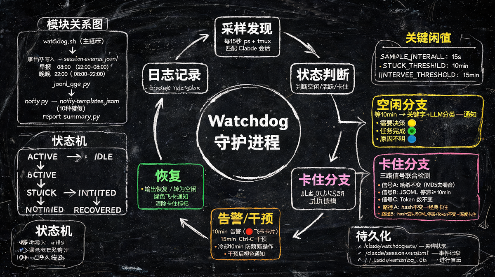

# Claude Code Session Watchdog


English | [中文](README_zh-CN.md)

Auto-monitor tmux Claude Code sessions, detect stuck sessions, and auto-intervene.

**[Interactive Walkthrough](docs/interactive-guide.html)** — open in a browser for architecture diagrams, flow demos, and a quiz.

## Why

Once you move beyond the basics of Claude Code, you inevitably start running multiple sessions in parallel — different projects, or even multiple sessions within one project (one writing specs, another implementing code). Since closing the Claude CLI terminates the session, tmux becomes the standard way to keep sessions alive across locations: office, home, commute.

But this creates a new problem: **session state management**. With 5 or 10 sessions running, you can't keep track of which ones are progressing, which are stuck waiting for an API response, and which have silently stalled. You check in on a session only to find it's been idle for hours. The watchdog solves this — it watches all your sessions continuously, alerts you when something is wrong, and can auto-recover stuck sessions without losing context.

## How It Works



```
Sample all tmux panes every 15 seconds
  |
  v
Triple detection: screen hash + JSONL log last record + output token stagnation
  |
  v
No valid output for 10 min --> Log stuck event + macOS notification + Feishu alert
  |
  v
No valid output for 15 min --> Auto-send Ctrl-C + "continue" message
  |
  v
Output resumes              --> Log recovered event
```

## Features

- **Triple detection** -- screen-content hash (timer-noise filtered), JSONL session-log last record, and output-token stagnation run in parallel; all three must agree before declaring a session stuck
- **Auto-intervention** -- non-destructive: sends Ctrl-C followed by a continue prompt after 15 minutes of inactivity (10-minute cooldown to prevent flapping), without killing the process or losing context
- **Idle classification with LLM** -- keyword-based matching plus optional LLM semantic analysis (primary + fallback endpoints) to classify idle sessions as *decision needed*, *task complete*, or *unknown*
- **Feishu / Lark notifications** -- HMAC-signed webhook with 10 template types (stuck, intervene, recovered, start, daily, morning/evening report, idle decision/complete/unknown)
- **macOS local notifications** -- native `osascript` alerts as a zero-config fallback
- **Periodic reports** -- morning report (08:00, covers overnight) and evening report (22:00, covers daytime) with per-session breakdowns
- **Event self-review** -- LLM audits past detection events to surface false positives and tuning suggestions

## Prerequisites

| Requirement | Why |
|---|---|
| **tmux** | All detection and intervention (`send-keys`) depend on tmux. Claude Code sessions must run inside tmux. |
| **Python 3** | JSON parsing, HMAC signing, Feishu notification delivery, idle classification. |
| **macOS** | Uses `osascript` for local notifications and `md5` for hashing. Linux would need command replacements. |
| **Auto-permission wrapper** | Unattended sessions need a wrapper like `claude-yes` or `agent-yes` to auto-approve Claude Code permission prompts. Without this, the watchdog cannot distinguish "waiting for permission" from "genuinely stuck". |
| **Feishu group bot** *(optional)* | Adds a bot to a Feishu group chat to deliver real-time alerts (stuck, recovered, idle classification) so you can stay informed without checking tmux. |

## Quick Start

```bash
# Clone
git clone https://github.com/zwyin/claude-session-watchdog.git
cd claude-session-watchdog

# Configure notifications (optional -- skip to use macOS-only alerts)
cp .env.example .env
# Edit .env with your Feishu webhook / LLM API credentials

# Run a single detection pass
./scripts/watchdog.sh run

# Start as a background daemon
./scripts/watchdog.sh start

# Run in foreground (for launchd or containers)
./scripts/watchdog.sh daemon
```

### All Commands

| Command | Description |
|---|---|
| `./scripts/watchdog.sh run` | Single detection pass (default) |
| `./scripts/watchdog.sh start` | Start background daemon |
| `./scripts/watchdog.sh daemon` | Foreground loop (for launchd) |
| `./scripts/watchdog.sh stop` | Stop background daemon |
| `./scripts/watchdog.sh status` | Show daemon status |
| `./scripts/watchdog.sh sessions` | List all Claude sessions (model, tokens, JSONL age) |
| `./scripts/watchdog.sh health` | Health check (process alive + log freshness) |
| `./scripts/watchdog.sh log [N]` | Show last N log lines (default 50) |
| `./scripts/watchdog.sh test-notify` | Send test notifications (all 10 types) |
| `./scripts/watchdog.sh daily-summary` | Manually send daily report |
| `./scripts/watchdog.sh review [hours]` | LLM audit of recent detection events (default 12h) |

## Configuration

### Environment Variables (`.env`)

**Minimum config for basic use** — no `.env` needed. The watchdog works out of the box with macOS notifications and keyword-only idle classification. Configure the following only when you need the corresponding feature.

#### Notification (optional)

| Variable | Default | Required? | Description |
|---|---|---|---|
| `FEISHU_WEBHOOK` | *(empty)* | No | Feishu bot webhook URL. Both `FEISHU_WEBHOOK` and `FEISHU_SECRET` must be set to enable Feishu notifications. If either is missing, only macOS local notifications are sent. |
| `FEISHU_SECRET` | *(empty)* | No | Feishu webhook signing secret for HMAC verification. |

#### LLM idle classification (optional)

| Variable | Default | Required? | Description |
|---|---|---|---|
| `WATCHDOG_LLM_API_KEY` | *(empty)* | No | API key for idle-classification LLM. **Without this, LLM classification is skipped entirely** — idle sessions are classified by keyword matching only (lower accuracy). |
| `WATCHDOG_LLM_BASE_URL` | `https://api.anthropic.com` | No | LLM API base URL. Works with any OpenAI- or Anthropic-compatible endpoint. |
| `WATCHDOG_LLM_MODEL` | `claude-haiku-4-5-20251001` | No | Model name for idle classification. |
| `WATCHDOG_LLM_FORMAT` | *(auto-detect)* | No | API format: `anthropic` or `openai`. Leave empty to auto-detect from the base URL. |

#### Fallback LLM endpoint (optional)

Used only when the primary endpoint fails. If `WATCHDOG_LLM_API_KEY_2` is not set, no fallback is attempted.

| Variable | Default | Required? | Description |
|---|---|---|---|
| `WATCHDOG_LLM_API_KEY_2` | *(empty)* | No | Fallback endpoint API key. |
| `WATCHDOG_LLM_BASE_URL_2` | *(empty)* | No | Fallback endpoint base URL. |
| `WATCHDOG_LLM_MODEL_2` | *(empty)* | No | Fallback endpoint model name. |
| `WATCHDOG_LLM_FORMAT_2` | `openai` | No | Fallback API format. |

### Tuning Parameters (in `scripts/watchdog.sh`)

| Parameter | Default | Description |
|---|---|---|
| `SAMPLE_INTERVAL` | `15` | Seconds between sampling each tmux pane. |
| `STUCK_THRESHOLD` | `600` (10 min) | Seconds without valid output before declaring stuck and sending alerts. |
| `INTERVENE_THRESHOLD` | `900` (15 min) | Seconds without valid output before auto-sending Ctrl-C + continue. |
| `INTERVENE_COOLDOWN` | `600` (10 min) | Minimum seconds between interventions for the same session. |
| `JSONL_STALE_THRESHOLD` | `600` (10 min) | Seconds since last JSONL log entry before considering the log stale. |
| `IDLE_CLASSIFY_THRESHOLD` | `600` (10 min) | Seconds of inactivity before triggering idle classification. |
| `DAILY_SUMMARY_HOUR` | `22` | Hour (0-23) to send the evening report. |
| `MORNING_SUMMARY_HOUR` | `08` | Hour (0-23) to send the morning report. |

## launchd Setup (macOS Auto-Start)

Create `~/Library/LaunchAgents/com.claude.watchdog.plist`:

```xml
<?xml version="1.0" encoding="UTF-8"?>
<!DOCTYPE plist PUBLIC "-//Apple//DTD PLIST 1.0//EN"
  "http://www.apple.com/DTDs/PropertyList-1.0.dtd">
<plist version="1.0">
<dict>
    <key>Label</key>
    <string>com.claude.watchdog</string>
    <key>ProgramArguments</key>
    <array>
        <string>/Users/YOU/repo/claude-session-watchdog/scripts/watchdog.sh</string>
        <string>daemon</string>
    </array>
    <key>RunAtLoad</key>
    <true/>
    <key>KeepAlive</key>
    <true/>
    <key>StandardOutPath</key>
    <string>/Users/YOU/.claude/watchdog.log</string>
    <key>StandardErrorPath</key>
    <string>/Users/YOU/.claude/watchdog.log</string>
    <key>WorkingDirectory</key>
    <string>/Users/YOU/repo/claude-session-watchdog</string>
</dict>
</plist>
```

```bash
# Enable
launchctl load ~/Library/LaunchAgents/com.claude.watchdog.plist

# Disable
launchctl unload ~/Library/LaunchAgents/com.claude.watchdog.plist
```

## Architecture

The detection pipeline runs in a loop every `SAMPLE_INTERVAL` seconds:

1. **Discover** -- find all tmux panes running `claude` or `claude-yes`.
2. **Capture** -- snapshot each pane's visible output; compute a content hash with timer/counter noise stripped.
3. **Cross-check** -- read the session's JSONL log for the last record timestamp and the current output token count.
4. **Classify** -- a session is considered stuck only when all three signals agree (hash unchanged, JSONL stale, tokens stagnant).
5. **Act** -- alert at `STUCK_THRESHOLD`; auto-intervene at `INTERVENE_THRESHOLD`; classify idle sessions via keywords and optional LLM.

State is stored as flat files under `~/.claude/watchdog-state/` -- no database required.

## File Locations

| Path | Purpose |
|---|---|
| `scripts/watchdog.sh` | Main script (detection, intervention, daemon) |
| `scripts/classify_idle.py` | Idle session classifier (keyword + LLM) |
| `scripts/notify.py` | Feishu notification delivery with HMAC signing |
| `scripts/llm_utils.py` | Shared LLM API call helper (Anthropic + OpenAI formats) |
| `scripts/review_events.py` | LLM-based review of past detection events |
| `scripts/report_summary.py` | Period summary statistics for morning/evening reports |
| `scripts/jsonl_age.py` | JSONL last-record age extraction |
| `scripts/notify-templates.json` | Feishu notification templates (10 types) |
| `docs/interactive-guide.html` | Interactive project walkthrough (open in browser) |
| `docs/how-it-works.png` | "How It Works" infographic |
| `.env.example` | Configuration template |
| `~/.claude/watchdog.pid` | Background daemon PID |
| `~/.claude/watchdog.lock` | Process lock (mkdir-based atomic lock) |
| `~/.claude/watchdog.log` | Runtime log |
| `~/.claude/watchdog-state/` | Per-session sampling state |
| `~/.claude/session-events.jsonl` | Stuck / recovered event log |
| `~/Library/LaunchAgents/com.claude.watchdog.plist` | launchd auto-start config |

## License

[MIT](LICENSE) -- see the [LICENSE](LICENSE) file for details.

---

> **中文文档**: [README_zh-CN](README_zh-CN.md) | [设计文档](docs/design/) | [互动式导览](docs/interactive-guide.html)
